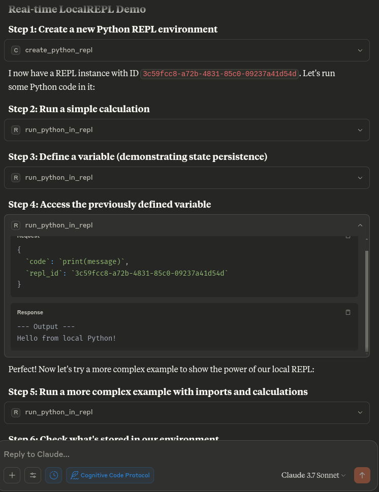

# LocalREPL MCP Server

A locally-running Python REPL server that integrates with Claude Desktop through the Model Context Protocol (MCP).
This runs entirely on your local machine with no need for API keys or remote execution.

## Features

- **Completely Local**: Run Python code directly on your machine without any remote dependencies
- **State Persistence**: Maintain state between code executions (completely local)
- **MCP Integration**: Fully compatible with Claude Desktop through the Model Context Protocol
- **No API Keys**: No registration, signup, or API keys required
- **Privacy-Focused**: Your code never leaves your machine if you use local models
- **Simple & Secure**: Straightforward implementation with minimal dependencies



## Installation

### Prerequisites

- Python 3.10 or higher
- [Claude Desktop](https://claude.ai/download)

### Setup

1. Clone this repository
   ```bash
   git clone https://github.com/angrysky56/local-repl-mcp.git
   ```

## Quickstart:

## You can just copy this into your mcp config json edit the path to your own, and should be good to go:

```json
{
  "mcp_servers": {
    "LocalREPL": {
      "command": "uv",
      "args": [
        "--directory",
        "/home/ty/Repositories/ai_workspace/local-repl-mcp/local_repl",
        "run",
        "server.py"
      ]
    }
  }
}
```

## Usage

# Optional: Install additional packages you want to use in your REPL:
   ```bash
   uv add numpy pandas matplotlib
   ```
Once the server is installed in Claude Desktop, you can use the following tools:

- `create_python_repl()` - Creates a new Python REPL and returns its ID
- `run_python_in_repl(code, repl_id)` - Runs Python code in the specified REPL
- `list_active_repls()` - Lists all active REPL instances
- `get_repl_info(repl_id)` - Shows information about a specific REPL
- `delete_repl(repl_id)` - Deletes a REPL instance

### Example Workflow

```python
# First create a new REPL
repl_id = create_python_repl()

# Run some code
result = run_python_in_repl(
  code="x = 42\nprint(f'The answer is {x}')",
  repl_id=repl_id
)

# Run more code in the same REPL (with state preserved)
more_results = run_python_in_repl(
  code="import math\nprint(f'The square root of {x} is {math.sqrt(x)}')",
  repl_id=repl_id
)

# Check what variables are available in the environment
environment_info = get_repl_info(repl_id)

# When done, you can delete the REPL
delete_repl(repl_id)
```

## Advantages

- **No Registration**: No need to sign up or request API tokens
- **Full Privacy**: All code execution happens on your local machine
- **No Usage Limits**: Not restricted by API rate limits or quotas
- **Complete Control**: Modify and extend functionality as needed
- **Offline Usage**: Works without an internet connection
- **Free & Open Source**: No associated costs or usage fees


## Development

To run the server during development:

```bash
mcp dev server.py
```

## Try this stuff if you need to, untested:

2. Create a virtual environment:
   ```bash
   # Using uv (recommended)
   uv venv --python 3.12 --seed

   # Or using standard venv
   python -m venv .venv
   ```

3. Activate the virtual environment:
   ```bash
   # On Linux/macOS
   . .venv/bin/activate

   # On Windows
   .venv\Scripts\activate
   ```

4. cd local-repl-mcp
   Install the package:
   ```bash
   # Using uv
   uv pip install -e .

   # Using pip
   pip install -e .
   ```

## No idea if this works:

Run the following command to generate a configuration file for Claude Desktop:

```bash
mcp install server.py
```

## Troubleshooting

- **EPIPE errors**: If you see EPIPE errors, restart the Claude Desktop application
- **Missing packages**: If your code requires specific packages, install them in the same virtual environment
- **Connection issues**: Ensure the server path in your configuration is correct
- **MCP tools not appearing**: Check your Claude Desktop configuration and restart the application

## License

MIT
