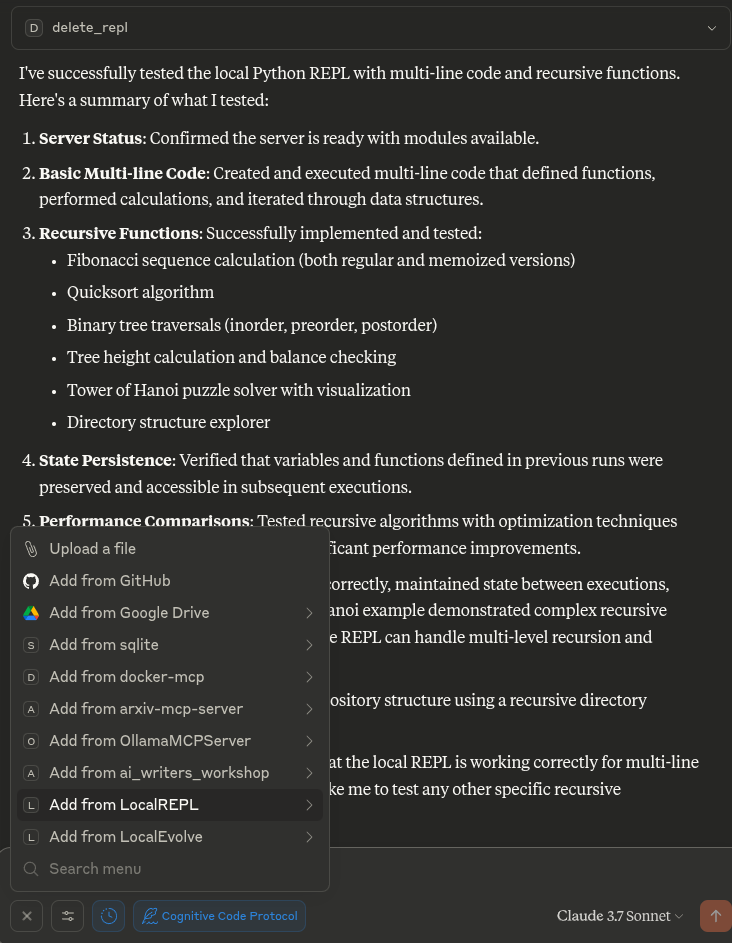
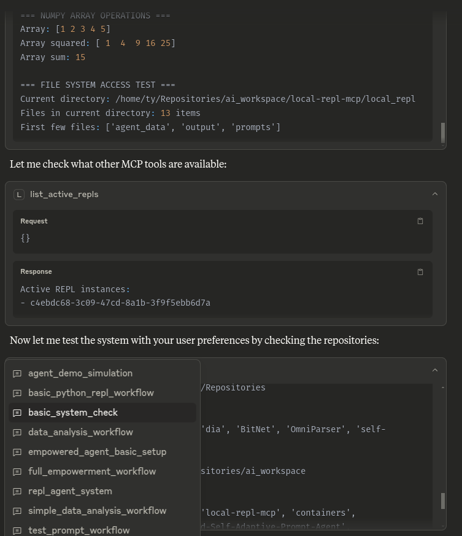

# LocalREPL MCP Server

A locally-running Python REPL server that integrates with Claude Desktop through the Model Context Protocol (MCP).

## Features
- **Local REPL**: Runs a Python REPL server locally

### **1. System Discovery Workflow**
- **Purpose**: Methodical exploration of the full system capabilities
- **Approach**: Phase-by-phase discovery with comprehensive documentation
- **Output**: Complete system mapping and enhancement opportunities

### **2. Advanced Workflow Orchestration**
- **Purpose**: Complex multi-stage workflows with dependency management
- **Features**: Task execution engine, error handling, performance monitoring
- **Templates**: Data analysis, research, multi-agent coordination workflows

### **3. Strategic Capability Enhancement**
- **Purpose**: Systematic enhancement of system capabilities
- **Framework**: Phase 1 (Planning) → Phase 2 (Execution) → Phase 3 (Adaptation)
- **Implementation**: Sample agent communication and performance monitoring systems

### **4. Agent Communication and Performance Monitoring
- **Persistent Agent Intelligence** with JSON state storage
- **Empowerment Optimization Framework** with energy tracking
- **Advanced Memory Systems** with categorization and tagging
- **Workflow Orchestration** capabilities
- **Evolution Database** tracking agent learning
- **Multi-REPL Coordination** for parallel processing

### **5. Other Advantages**
- **Completely Local**: Run Python code directly on your machine without any remote dependencies
- **State Persistence**: Maintain state between code executions (completely local)
- **MCP Integration**: Fully compatible with Claude Desktop through the Model Context Protocol
- **No API Keys**: No registration or signup required
- **Privacy-Focused**: Your code never leaves your machine if you use local models
- **Simple & Secure**: Straightforward implementation with minimal dependencies

- **New Additions**:
    See Modular-Empowerment-README.md or just try the prompts!

# Potential Use Cases for LocalREPL

There are several powerful use cases for a local Python REPL integrated with Claude:

## 1. **Interactive Learning Environment**
- Perfect for teaching programming concepts with immediate feedback
- Step through algorithms with Claude explaining each part
- Build understanding iteratively without switching between tools

## 2. **Data Analysis Workflow**
- Process and analyze data with state persistence
- Incrementally build analysis pipelines with guidance from Claude
- Visualize results and refine approach without context switching

## 3. **Secure Code Experimentation**
- Experiment with sensitive code or data that shouldn't leave your machine
- Test financial algorithms, personal automation, or proprietary code
- Avoid exposing intellectual property to third-party services

## 4. **Incremental Development**
- Build solutions step-by-step with Claude's guidance
- Maintain context and state throughout development sessions
- Refine code based on immediate feedback and results

## 5. **Local AI Integration Testing**
- Test integrations with local AI models
- Process inputs and outputs for AI systems
- Build preprocessing and postprocessing pipelines

## 6. **Automated Documentation Generation**
- Generate documentation from code inspection
- Test and refine documentation examples
- Create interactive tutorials with working code examples

## 7. **Private API Testing**
- Explore internal or sensitive APIs without exposing credentials
- Build up complex API requests incrementally
- Test authentication flows and data handling

## 8. **Local System Automation**
- Control and interact with local services securely
- Build automation scripts that don't require internet access
- Test system modifications in a controlled environment

## 9. **Continuous Computational Context**
- Maintain a persistent computational environment between conversations
- Build on previous calculations without starting over
- Create complex multi-step analyses with Claude's guidance

## 10. **Educational Demonstrations**
- Create interactive coding tutorials
- Demonstrate concepts with working code examples
- Allow students to experiment safely within Claude


## Installation

### Prerequisites

- Python 3.10 or higher
- [Claude Desktop](https://claude.ai/download)

### Setup

1. Clone this repository
   ```bash
   git clone https://github.com/angrysky56/local-repl-mcp.git
   ```

## Quickstart:

## You can just copy this into your mcp config json edit the path to your own, and should be good to go:

```json
{
  "mcp_servers": {
    "LocalREPL": {
      "command": "uv",
      "args": [
        "--directory",
        "/home/ty/Repositories/ai_workspace/local-repl-mcp/local_repl",
        "run",
        "server.py"
      ]
    }
  }
}
```





## Usage
  # Some of these packages will take some time to install, I suggest you do this if they take too long to install:

# Optional: Install additional packages you want to use in your REPL:

cd local-repl-mcp

  ```bash
  # Using uv (recommended)
  # uv .venv/bin/activate && uv pip install <required-packages>
  # If you don't have uv installed, you can install it with:
  # pip install uv
  # Then if not made by the server activating via Claude you can create then activate the virtual environment with:
  # uv venv --python 3.12 --seed
  # Then you can activate the virtual environment with:
  uv .venv/bin/activate
  # And install the packages with:
  uv add numpy pandas matplotlib scipy scikit-learn tensorflow torch torchvision torchtext torchaudio seaborn sympy requests networkx beautifulsoup4 jupyter fastapi
  ```

# Once the server is installed in Claude Desktop, you can use the following tools,
# This info and much more is also available to Claude via the prompts folder and attachable by the + in the Desktop UI or /LocalREPL in others:

- `create_python_repl()` - Creates a new Python REPL and returns its ID
- `run_python_in_repl(code, repl_id)` - Runs Python code in the specified REPL
- `list_active_repls()` - Lists all active REPL instances
- `get_repl_info(repl_id)` - Shows information about a specific REPL
- `delete_repl(repl_id)` - Deletes a REPL instance

### Example Workflow

```python
# First create a new REPL
repl_id = create_python_repl()

# Run some code
result = run_python_in_repl(
  code="x = 42\nprint(f'The answer is {x}')",
  repl_id=repl_id
)

# Run more code in the same REPL (with state preserved)
more_results = run_python_in_repl(
  code="import math\nprint(f'The square root of {x} is {math.sqrt(x)}')",
  repl_id=repl_id
)

# Check what variables are available in the environment
environment_info = get_repl_info(repl_id)

# When done, you can delete the REPL
delete_repl(repl_id)
```

## Development

To run the server during development:

```bash
mcp dev server.py
```

## Try this stuff if you need to, untested:

2. Create a virtual environment:
   ```bash
   # Using uv (recommended)
   uv venv --python 3.12 --seed

   # Or using standard venv
   python -m venv .venv
   ```

3. Activate the virtual environment:
   ```bash
   # On Linux/macOS
   . .venv/bin/activate

   # On Windows
   .venv\Scripts\activate
   ```

4. cd local-repl-mcp
   Install the package:
   ```bash
   # Using uv
   uv pip install -e .

   # Using pip
   pip install -e .
   ```

## No idea if this works:

Run the following command to generate a configuration file for Claude Desktop:

```bash
mcp install server.py
```

## Troubleshooting

- **EPIPE errors**: If you see EPIPE errors, restart the Claude Desktop application
- **Missing packages**: If your code requires specific packages, install them in the same virtual environment
- **Connection issues**: Ensure the server path in your configuration is correct
- **MCP tools not appearing**: Check your Claude Desktop configuration and restart the application

## License

[MIT](https://github.com/angrysky56/local-repl-mcp/blob/master/LICENSE)
