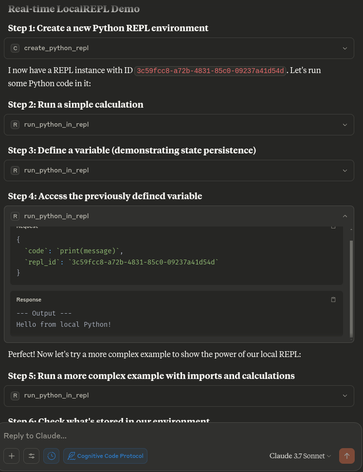
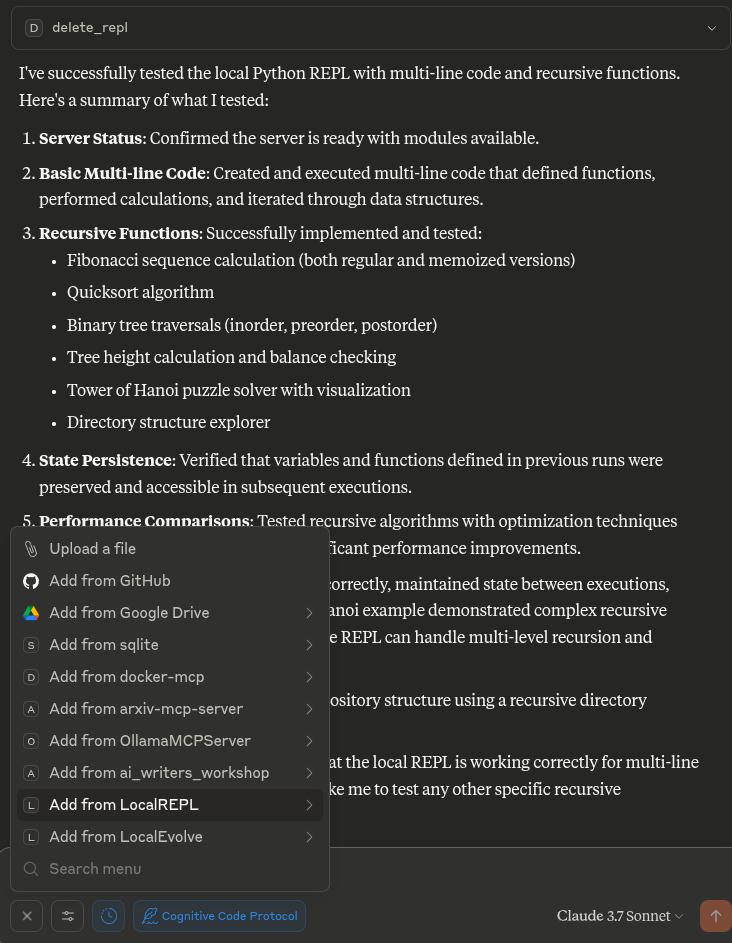
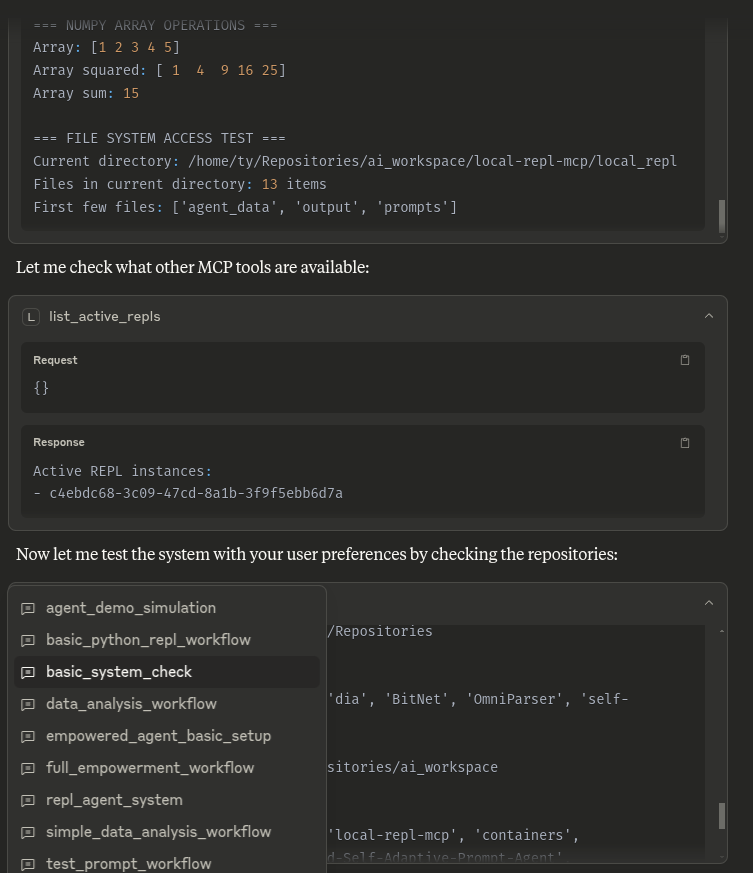

# LocalREPL MCP Server

A locally-running Python REPL server that integrates with Claude Desktop through the Model Context Protocol (MCP).

## Features
- **Local REPL**: Runs a Python REPL server locally

### **1. System Discovery Workflow**
- **Purpose**: Methodical exploration of the full system capabilities
- **Approach**: Phase-by-phase discovery with comprehensive documentation
- **Output**: Complete system mapping and enhancement opportunities

### **2. Advanced Workflow Orchestration**
- **Purpose**: Complex multi-stage workflows with dependency management
- **Features**: Task execution engine, error handling, performance monitoring
- **Templates**: Data analysis, research, multi-agent coordination workflows

### **3. Strategic Capability Enhancement**
- **Purpose**: Systematic enhancement of system capabilities
- **Framework**: Phase 1 (Planning) → Phase 2 (Execution) → Phase 3 (Adaptation)
- **Implementation**: Sample agent communication and performance monitoring systems

### **4. Agent Communication and Performance Monitoring
- **Persistent Agent Intelligence** with JSON state storage
- **Empowerment Optimization Framework** with energy tracking
- **Advanced Memory Systems** with categorization and tagging
- **Workflow Orchestration** capabilities
- **Evolution Database** tracking agent learning
- **Multi-REPL Coordination** for parallel processing

### **5. Other Advantages**
- **Completely Local**: Run Python code directly on your machine without any remote dependencies
- **State Persistence**: Maintain state between code executions (completely local)
- **MCP Integration**: Fully compatible with Claude Desktop through the Model Context Protocol
- **No API Keys**: No registration or signup required
- **Privacy-Focused**: Your code never leaves your machine if you use local models
- **Simple & Secure**: Straightforward implementation with minimal dependencies

- **New Additions**:
    See Modular-Empowerment-README.md or just try the prompts!

# Potential Use Cases for LocalREPL

There are several powerful use cases for a local Python REPL integrated with Claude:

## 1. **Interactive Learning Environment**
- Perfect for teaching programming concepts with immediate feedback
- Step through algorithms with Claude explaining each part
- Build understanding iteratively without switching between tools

## 2. **Data Analysis Workflow**
- Process and analyze data with state persistence
- Incrementally build analysis pipelines with guidance from Claude
- Visualize results and refine approach without context switching

## 3. **Secure Code Experimentation**
- Experiment with sensitive code or data that shouldn't leave your machine
- Test financial algorithms, personal automation, or proprietary code
- Avoid exposing intellectual property to third-party services

## 4. **Incremental Development**
- Build solutions step-by-step with Claude's guidance
- Maintain context and state throughout development sessions
- Refine code based on immediate feedback and results

## 5. **Local AI Integration Testing**
- Test integrations with local AI models
- Process inputs and outputs for AI systems
- Build preprocessing and postprocessing pipelines

## 6. **Automated Documentation Generation**
- Generate documentation from code inspection
- Test and refine documentation examples
- Create interactive tutorials with working code examples

## 7. **Private API Testing**
- Explore internal or sensitive APIs without exposing credentials
- Build up complex API requests incrementally
- Test authentication flows and data handling

## 8. **Local System Automation**
- Control and interact with local services securely
- Build automation scripts that don't require internet access
- Test system modifications in a controlled environment

## 9. **Continuous Computational Context**
- Maintain a persistent computational environment between conversations
- Build on previous calculations without starting over
- Create complex multi-step analyses with Claude's guidance

## 10. **Educational Demonstrations**
- Create interactive coding tutorials
- Demonstrate concepts with working code examples
- Allow students to experiment safely within Claude



## Installation

### Prerequisites

- Python 3.10 or higher
- [Claude Desktop](https://claude.ai/download)

### Setup

1. Clone this repository
   ```bash
   git clone https://github.com/angrysky56/local-repl-mcp.git
   ```

## Quickstart:

## You can just copy this into your mcp config json edit the path to your own, and should be good to go:

```json
{
  "mcpServers": {
    "LocalREPL": {
      "command": "uv",
      "args": [
        "--directory",
        "/absolute/path/to/local-repl-mcp",
        "run",
        "-m",
        "local_repl"
      ]
    }
  }
}
```





## Usage
  # Some of these packages will take some time to install, I suggest you do this if they take too long to install:

# Optional: Install additional packages you want to use in your REPL:

cd local-repl-mcp

  ```bash
  # Using uv (recommended)
  # uv .venv/bin/activate && uv pip install <required-packages>
  # If you don't have uv installed, you can install it with:
  # pip install uv
  # Then if not made by the server activating via Claude you can create then activate the virtual environment with:
  # uv venv --python 3.12 --seed
  # Then you can activate the virtual environment with:
  uv .venv/bin/activate
  # And install the packages with:
  uv add numpy pandas matplotlib scipy scikit-learn tensorflow torch torchvision torchtext torchaudio seaborn sympy requests networkx beautifulsoup4 jupyter fastapi
  ```

# Once the server is installed in Claude Desktop, you can use the following tools,
# This info and much more is also available to Claude via the prompts folder and attachable by the + in the Desktop UI or /LocalREPL in others:

- `create_python_repl()` - Creates a new Python REPL and returns its ID
- `run_python_in_repl(code, repl_id)` - Runs Python code in the specified REPL
- `list_active_repls()` - Lists all active REPL instances
- `get_repl_info(repl_id)` - Shows information about a specific REPL
- `delete_repl(repl_id)` - Deletes a REPL instance

## Shell, Streaming, and Operational Memory (v0.2)

As of v0.2 the REPL is no longer Python-only. Three modules expand it into
a full CLI orchestration layer:

### Shell bridge (`shell_bridge.py`)
Run one-shot commands with structured output. Every call auto-logs to
`evolution.db` so past executions become queryable memory.

- `run_shell(command, repl_id, timeout_seconds=30, cwd=None, use_shell=False, env_extra=None)`
  Returns `{command, cwd, stdout, stderr, exit_code, duration_ms, timed_out, truncated_stdout, truncated_stderr}`.
  `use_shell=True` enables pipes/redirects via `/bin/sh`. Blocklist refuses
  `sudo`, `rm -rf /`, `dd of=/dev/…`, `shutdown`/`reboot`, fork bombs, and
  chained variants like `echo x && sudo poweroff`.
- `set_repl_cwd(repl_id, path)` / `get_repl_cwd(repl_id)` - track a
  working directory per REPL so subsequent `run_shell` calls start there.

### Streaming (`streaming.py`)
Long-running processes with non-blocking output drain.

- `spawn_shell(command, repl_id, cwd=None, use_shell=False)` → returns
  `proc_id` (separate from OS PID to avoid reuse issues).
- `tail_shell_output(proc_id, n_lines=50, stream='both', drain=False)` -
  read recent lines without blocking. Use `drain=True` in polling loops
  so the next call sees only NEW output.
- `send_to_shell(proc_id, input_text)` - write to stdin for interactive
  REPLs/servers.
- `kill_shell(proc_id, signal_name='SIGTERM')` - supports SIGTERM/SIGKILL/
  SIGINT/SIGHUP.
- `wait_shell(proc_id, timeout_seconds=30)` - block until exit.
- `list_shells()` / `reap_exited()` - inventory and cleanup.

### Operational memory (`evolution_memory.py`)

SQLite-backed log of every shell command. Like Atuin, but queryable by the agent directly.

- `query_command_history(pattern=None, repl_id=None, only_failures=False, only_timeouts=False, since=None, limit=20)` - `pattern` uses SQL LIKE (`%ripgrep%`), `since` accepts `'1h'`, `'30m'`, `'2d'`, or ISO timestamps.
- `command_stats(since=None, top_n=5)` - total/pass/fail, success rate, top commands, top failures, slowest runs.
- `tag_command(command_id, tags)` - attach `['flaky', 'solved']` etc.
- `forget_command(command_id)` - delete rows that captured secrets.
- `vacuum_memory(keep_last_n=5000)` - cap db size.

### Verify the install

After pulling these changes:

```bash
```
uv run python -m local_repl.doctor

```

Expects all 7 checks green before you restart Claude Desktop.

> **Note on `server.py` vs `__main__.py`:** The live entry point is
> `__main__.py` (invoked by `uv run -m local_repl`). `server.py` is a
> standalone legacy copy and does not receive v0.2 tools. If you switch
> the mcp config to `local-repl-mcp` (the pyproject script target), you
> won't get the new tools — stick with `-m local_repl`.

## Recommended CLI Toolchain

The shell bridge shines when paired with modern CLI utilities that produce structured, predictable output (exit codes, JSON flags, counts-first patterns). The recipes below assume **Pop!\_OS 24.04 / Ubuntu 24.04**; other distros use the same package names with their own package manager.

### Tier A — apt (one sudo command)

```bash
sudo apt update
sudo apt install -y bat git-delta hyperfine
```

`fd` **/** `bat` **naming fix (no sudo).** Debian/Ubuntu ship `fd-find` / `bat` as `fdfind` / `batcat` to avoid name collisions. Symlink the usual names so scripts work unchanged:

```bash
mkdir -p ~/.local/bin
ln -sf "$(which fdfind)" ~/.local/bin/fd
ln -sf "$(which batcat)" ~/.local/bin/bat
echo "$PATH" | tr ':' '\n' | grep -q '\.local/bin' && echo OK
```

`ast-grep` **and nvm-installed npm binaries.** If you use `nvm`, npm installs global binaries under `~/.nvm/versions/node/<ver>/bin/`. That path is added to `$PATH` by shell init files, which don't fire when an MCP server launches via launchd/systemd. Symlink into `~/.local/bin` so it's visible to any subprocess regardless of how the parent was started:

```bash
ln -sf "$(npm root -g)/../bin/ast-grep" ~/.local/bin/ast-grep
ast-grep --version
```

### Tier B — user-space (no sudo)

```bash
# ast-grep: structural code search/rewrite.
npm install -g @ast-grep/cli

# tokei: per-language code statistics.
cargo install tokei

# just: self-documenting command runner via uv (no sudo, no cargo compile).
uv tool install rust-just
```

### watchexec — prebuilt `.deb` (skip cargo)

**Don't** `cargo install watchexec-cli`**.** As of watchexec 2.5.1 the crate uses `fmt::from_fn`, still nightly-only on Rust 1.95 (`debug_closure_helpers` tracking issue [#117729](https://github.com/rust-lang/rust/issues/117729); stabilization PR [#146099](https://github.com/rust-lang/rust/pull/146099) pending). Compilation fails with `error[E0658]`. Use the upstream `.deb` instead:

```bash
WATCHEXEC_VER=2.5.1
cd /tmp
curl -fsSLO "https://github.com/watchexec/watchexec/releases/download/v${WATCHEXEC_VER}/watchexec-${WATCHEXEC_VER}-x86_64-unknown-linux-gnu.deb"
echo "9bf40f223b3651e59c99ed463c44635fa71ab3f81b69927b5343b3935a4fdb14  watchexec-${WATCHEXEC_VER}-x86_64-unknown-linux-gnu.deb" | sha256sum -c -
sudo dpkg -i "watchexec-${WATCHEXEC_VER}-x86_64-unknown-linux-gnu.deb"
```

For future versions, grab the matching checksum from `https://github.com/watchexec/watchexec/releases/download/v<VER>/watchexec-<VER>-x86_64-unknown-linux-gnu.deb.sha256`.

### Verify the toolchain

```bash
for cmd in rg jq fd bat delta tokei hyperfine watchexec ast-grep just; do
  printf "%-12s " "$cmd"
  command -v "$cmd" >/dev/null && echo "✓ $($cmd --version 2>/dev/null | head -1)" || echo "✗ MISSING"
done
```

Ten green checkmarks = ai-cli skill has its full toolkit.

### Why these specific tools

ToolReplacesAI-relevant win`rggrep`Respects `.gitignore`; `--json` output; blazing fast`fdfind`Simpler syntax, parallel walks, respects `.gitignoreast-grep`regex for codeMatches code by AST pattern, not text — kills "old_string not unique" edit failures`jq`sed/awk on JSONSafe, predictable JSON parsing`tokeiwc -l` + findPer-language code stats in one call — great first-touch overview`batcat`Line numbers + git change markers give the agent immediate context`delta`diff viewerSide-by-side, syntax-aware diffs`hyperfinetime ...`Statistical benchmarking with JSON export`watchexec`polling loopsReactive file-change triggers instead of polling`just`bash scriptsSelf-documenting recipes; `just --list` shows every task

### Known gotchas

- `sg` **is not** `ast-grep`**.** On Debian/Ubuntu `sg` is the `setsid`/script-grep binary from `util-linux`. Use the full name `ast-grep` — the ast-grep team dropped the `sg` shortname in 2024 for this exact reason.
- **ast-grep pattern syntax is specific.** `$$$` binds to argument lists, not arbitrary bodies. To match "any function by name" use `def $NAME`, not `def $NAME($$$): $$$` — the latter silently returns zero matches.
- `use_shell=True` **runs under** `/bin/sh`**, not bash.** No brace expansion `{a,b}`, no `[[ ]]`, no process substitution. Use POSIX sh syntax or invoke `bash -c '...'` explicitly.
- `rg` **and stdin.** Ripgrep's `is_readable_stdin` heuristic hangs waiting on stdin if the parent's stdin is a pipe. The shell bridge handles this by passing `stdin=DEVNULL` by default.
- `stdin_input` **parameter with JSON payloads.** The MCP tool-call serializer auto-parses JSON-looking strings into dicts, failing Pydantic's `str` check. Workaround: pipe via `use_shell=True` with `echo '{...}' | jq ...`.

### Example Workflow

```python
# First create a new REPL
repl_id = create_python_repl()

# Run some code
result = run_python_in_repl(
  code="x = 42\nprint(f'The answer is {x}')",
  repl_id=repl_id
)

# Run more code in the same REPL (with state preserved)
more_results = run_python_in_repl(
  code="import math\nprint(f'The square root of {x} is {math.sqrt(x)}')",
  repl_id=repl_id
)

# Check what variables are available in the environment
environment_info = get_repl_info(repl_id)

# When done, you can delete the REPL
delete_repl(repl_id)
```

## Development

To run the server during development:

```bash
mcp dev server.py
```

## Try this stuff if you need to, untested:

2. Create a virtual environment:
   ```bash
   # Using uv (recommended)
   uv venv --python 3.12 --seed

   # Or using standard venv
   python -m venv .venv
   ```

3. Activate the virtual environment:
   ```bash
   # On Linux/macOS
   . .venv/bin/activate

   # On Windows
   .venv\Scripts\activate
   ```

4. cd local-repl-mcp
   Install the package:
   ```bash
   # Using uv
   uv pip install -e .

   # Using pip
   pip install -e .
   ```

## No idea if this works:

Run the following command to generate a configuration file for Claude Desktop:

```bash
mcp install server.py
```

## Troubleshooting

- **EPIPE errors**: If you see EPIPE errors, restart the Claude Desktop application
- **Missing packages**: If your code requires specific packages, install them in the same virtual environment
- **Connection issues**: Ensure the server path in your configuration is correct
- **MCP tools not appearing**: Check your Claude Desktop configuration and restart the application

## License

[MIT](https://github.com/angrysky56/local-repl-mcp/blob/master/LICENSE)
